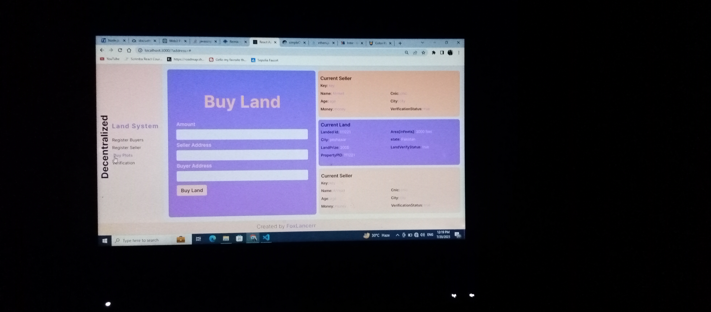
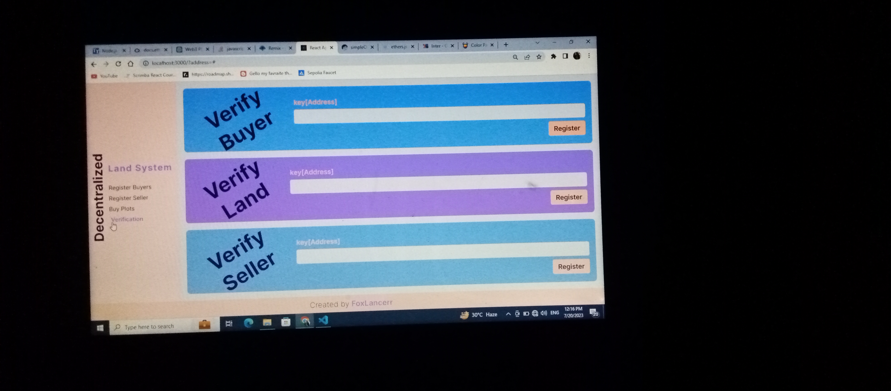

# Decentralized Land Registration System.

### language Used

- React
- Css
- JavaScript
- Solidity

### which network i used for deploying:

- sepolia Testnet

### contractAddress

- click here >>
  [0x0a1DDD72C1D3208EC837E652e04075962011960a](https://sepolia.etherscan.io/address/0x0a1ddd72c1d3208ec837e652e04075962011960a)

## How front End Look Like

### buyer register page

### buy plot page

### verification page

### seller register page

